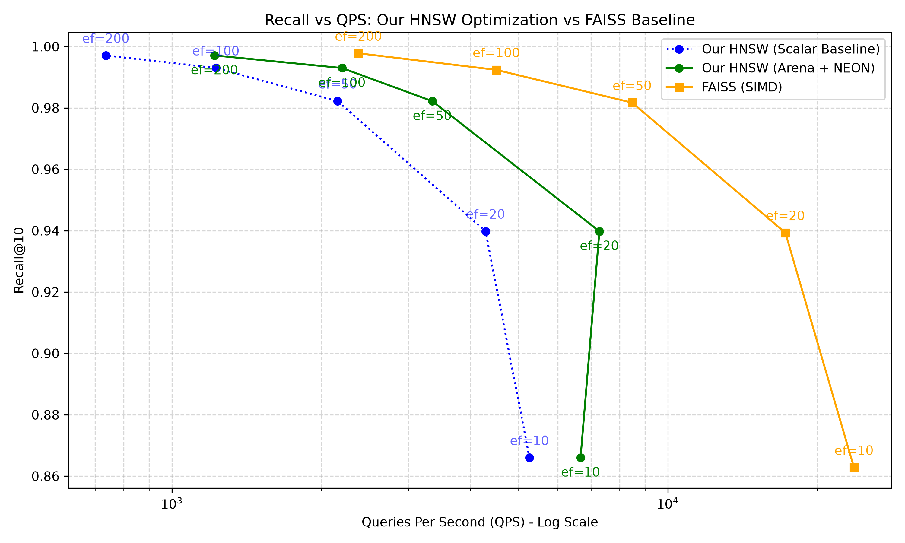

# C++ HNSW Vector Search Engine

This is a from-scratch, dependency-free C++ implementation of the Hierarchical Navigable Small World (HNSW) algorithm for approximate nearest neighbor (ANN) search. It evaluates raw float embeddings and natively features a flat memory arena, ARM NEON SIMD hardware acceleration, custom disk persistence, and a lightweight JSON REST API. The codebase relies on zero external ANN libraries, was benchmarked rigorously against FAISS, and was verified end-to-end for memory safety using AddressSanitizer.

## Quick Start

### Build
```bash
git clone https://github.com/wsid24/HNSW-Vector-Search-Engine.git
cd HNSW-Vector-Search-Engine
mkdir build && cd build
cmake -DCMAKE_BUILD_TYPE=Release ..
make
```

### Run the API Server
```bash
# Ensure you are at the project root to load the cached index correctly
./build/hnsw_server
```

### Search via REST API
To search, the `/search` endpoint expects a JSON payload containing exactly `dim` floats (384 for our dataset). We can extract the first test query from the dataset and query the server like so:

```bash
# 1. Extract the first 384-dimensional query into a JSON file
python3 -c "
import numpy as np, json
q = np.fromfile('data/queries.bin', dtype=np.float32).reshape(-1, 384)[0].tolist()
with open('query_payload.json', 'w') as f:
    json.dump({'query': q, 'k': 5, 'ef': 100}, f)
"

# 2. Submit the query to the search API
curl -s -X POST -H "Content-Type: application/json" -d @query_payload.json http://localhost:8080/search | python3 -m json.tool
```

```json
{
    "results": [
        {"distance": 0.7614654302597046, "id": 73422},
        {"distance": 0.7915123701095581, "id": 36810},
        {"distance": 0.8388208150863647, "id": 36687},
        {"distance": 0.8762215971946716, "id": 19760},
        {"distance": 0.9283205270767212, "id": 63487}
    ]
}
```

## Semantic Search Example

To demonstrate the real-world semantic matching of the HNSW index, here are the actual results returned for the first query in our AG News test set (384-dim `all-MiniLM-L6-v2` embeddings):

**QUERY TEXT (Query 0):**
> IBM exec may become Computer Associates CEO NEW YORK -- Troubled business software company Computer Associates International Inc. has selected longtime IBM executive John Swainson as its new chief executive, The Wall Street Journal reported Monday.

**MATCH 1 (ID: 73422):**
> Eskew: UPS CEO Joins IBM #39;s Board Package deal: IBM (nyse: IBM - news - people ) added its 14th board member, Michael L. Eskew, chairman and chief executive of United Parcel Service (nyse: UPS - news - people ), on Tuesday.

**MATCH 2 (ID: 36810):**
> Computer Associates settles charges; ex-CEO indicted NEW YORK, September 23 (newratings.com) - The former Chairman and CEO of Computer Associates International (CA.NYS), Sanjay Kumar, has been charged with securities fraud in a multi-billion dollar accounting scandal.

**MATCH 3 (ID: 36687):**
> Computer Associates #39; ex-CEO is charged The former chief executive of software maker Computer Associates International was charged yesterday with securities fraud in a multibillion-dollar accounting 

**MATCH 4 (ID: 19760):**
> EMC hires ex-IBM grid guru for CTO role EMC has appointed Jeff Nick, the former chief architect of IBM #39;s grid computing initiative, as its senior vice-president and chief technology officer (CTO).

**MATCH 5 (ID: 63487):**
> PeopleSoft product exec follows CEO out the door Just a week after PeopleSoft ousted former chief executive Craig Conway, it has announced that another top executive - Ram Gupta, who had been executive vice president of products and technology -as left.

## Performance and Benchmarks

We rigorously benchmarked this implementation against FAISS (Facebook AI Similarity Search) using a dataset of 99,000 AG News embeddings. 

**Accuracy**: Our engine matches FAISS's own HNSW implementation within **~0.1% recall at every tested `ef` bound**.
**Speed**: A flat memory arena and ARM NEON SIMD distance computation yield a high-performance vector retrieval engine capable of thousands of QPS.

See [RESULTS.md](RESULTS.md) for the full profiling progression table, detailed latency percentiles, and the complete Recall vs QPS chart:



## Architecture & Credits

This engine faithfully implements the exact algorithms described in the original HNSW paper:
*Efficient and robust approximate nearest neighbor search using Hierarchical Navigable Small World graphs (Malkov & Yashunin, 2016)*

Specifically, the index utilizes the paper's **Algorithm 4 (diversity heuristic)** rather than naive neighbor pruning. The heuristic evaluates geometric relationships between neighbor candidates to ensure robust spatial coverage and connectivity throughout the graph.
